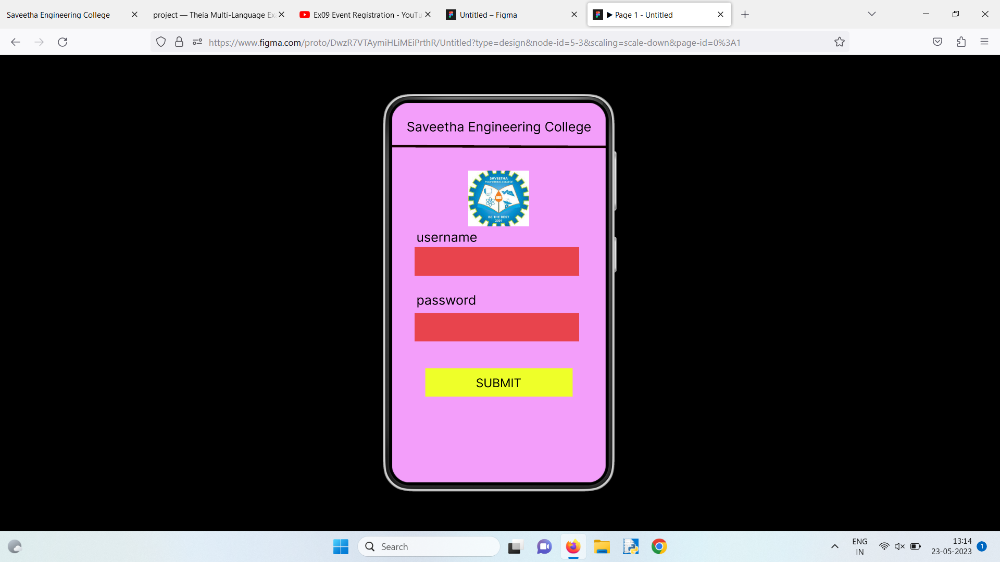
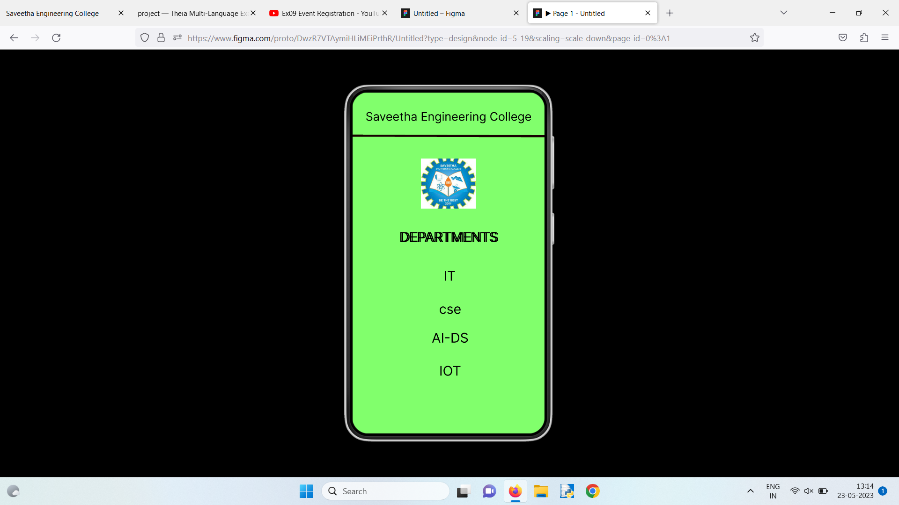

# Event Registration Web Application

## AIM:
To design, develop and deploy a web application for event registration.

## DESIGN STEPS:

### Step 1:

Create a new frame.
### Step 2:
Select any one preset of your choice.

### Step 3:
Select the shapes you need.

### Step 4:
Import images as needed.

### Step 5:
Create pages based on your need and link them.
### Step 6:

Validate the HTML and CSS code.

### Step 6:

Publish the website in the given URL.

## DESIGN TOOL:
Figma
## PROGRAM :
```
/* home page */

position: relative;
width: 360px;
height: 640px;

background: #90F8FE;


/* login page */

position: relative;
width: 360px;
height: 640px;

background: #F39EFA;


/* Text */

position: absolute;
width: 0px;
height: 54px;

font-family: 'Inter';
font-style: normal;
font-weight: 400;
font-size: 22px;
line-height: 27px;

color: #000000;


/* Saveetha Engineering College */

position: absolute;
width: 320px;
height: 34px;
left: 20px;
top: 31px;

font-family: 'Inter';
font-style: normal;
font-weight: 400;
font-size: 22px;
line-height: 27px;
text-align: center;

color: #000000;


/* Line 3 */

position: absolute;
width: 360px;
height: 0px;
left: 0px;
top: 83px;

border: 4px solid #180101;
transform: rotate(0.16deg);


/* logo 3 */

position: absolute;
width: 103px;
height: 94px;
left: 128px;
top: 124px;

background: url(logo.jpg);


/* DEPARTMENTS */

position: absolute;
width: 265px;
height: 35px;
left: 50px;
top: 256px;

font-family: 'Inter';
font-style: normal;
font-weight: 400;
font-size: 25px;
line-height: 30px;
text-align: center;

color: #000000;


/* DEPARTMENTS */

position: absolute;
width: 265px;
height: 35px;
left: 47px;
top: 256px;

font-family: 'Inter';
font-style: normal;
font-weight: 400;
font-size: 25px;
line-height: 30px;
text-align: center;

color: #000000;


/* IT */

position: absolute;
width: 150px;
height: 36px;
left: 107px;
top: 329px;

font-family: 'Inter';
font-style: normal;
font-weight: 400;
font-size: 25px;
line-height: 30px;
text-align: center;

color: #000000;


/* cse */

position: absolute;
width: 150px;
height: 36px;
left: 108px;
top: 391px;

font-family: 'Inter';
font-style: normal;
font-weight: 400;
font-size: 25px;
line-height: 30px;
text-align: center;

color: #000000;


/* AI-DS */

position: absolute;
width: 150px;
height: 36px;
left: 108px;
top: 445px;

font-family: 'Inter';
font-style: normal;
font-weight: 400;
font-size: 25px;
line-height: 30px;
text-align: center;

color: #000000;


/* IOT */

position: absolute;
width: 150px;
height: 36px;
left: 108px;
top: 507px;

font-family: 'Inter';
font-style: normal;
font-weight: 400;
font-size: 25px;
line-height: 30px;
text-align: center;

color: #000000;

```

## OUTPUT:





## Result:

The program to design, develop and deploy a web application for event registration is
completed successfully.